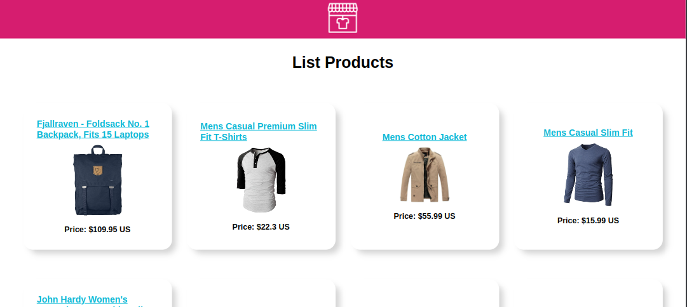
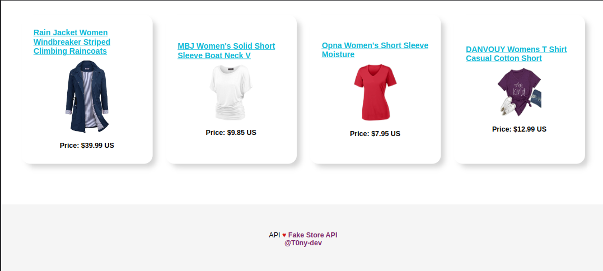
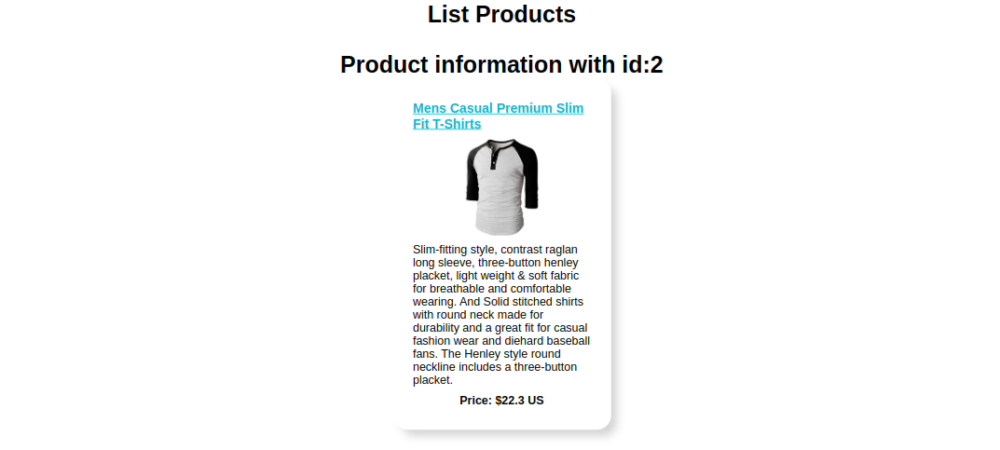

  <h1>Fake Store Api</h1>
  <strong>Documentación del proyecto y marcos de trabajo que se utilizan</strong> 
  <strong>Consulta de api con react.js</strong>

 

Proyecto de consulta de la API Fake Store API
 

### 🏗 Equipo de Ingeniería  

- [@T0ny-dev](https://github.com/T0ny-dev)

### 👨‍💻 Listados de marcos de trabajo

* ReactJS
* AXIOS
* Vite

### 💻 Listados comandos 

* `npm run dev `  iniciara el servidor para vista previa en localhost:5173
* `npm run build `  iniciara vite build

### 🗎 descargar de proyecto y colabora

* para descargar `git clone` y instalar dependencias `npm install`
* Revisar estatus de issues, Crear una nueva rama y empujar los cambios
* Solicitar revisión y comentar en github

### 🗎 Capturas

